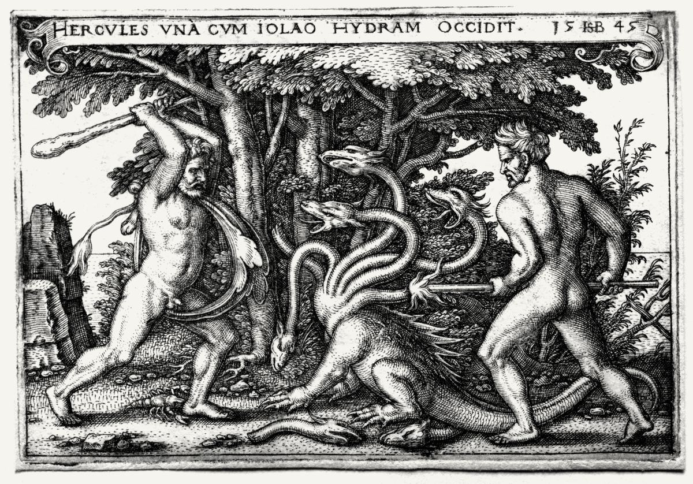

# hydra

<picture>
  <source media="(prefers-color-scheme: dark)" srcset="art/hydra-hero-dark.jpg">
  
</picture>

The shelf. Small brand projects that were questions first, then got tired of being arguments.

Nine heads, one neck. Each project answers one question about language, positioning, or the distance between what a company claims and what it is. Cut one off, another shows up.

## On the shelf

| Project | Address | State |
|---|---|---|
| Slop Detector | [hydra.peticila.ro/slop](https://hydra.peticila.ro/slop/) | live, free, runs in your browser |
| Voice Fingerprint | [aah.monster/voice-fingerprint](https://aah.monster/voice-fingerprint/) | live, paid, 249 euro |
| Homepage Roaster | hydra.peticila.ro/roast | not built yet |
| Aah, Monster! | [aah.monster](https://aah.monster) | live, its own domain, its own buyer |
| Right now | [peticila.ro/#now](https://peticila.ro/#now) | live |

One project sits off the shelf on purpose. Aah, Monster! has a buyer of its own, so it gets an address of its own. Everything else lives here.

## Stack

Hand-written HTML and CSS. Fonts and images inlined, so a page is one file and one request. No framework, no build step at serve time, no tracking. GitHub Pages, Cloudflare DNS.

The pages are generated by `build_claude_v1.py` (kept in the private working folder, not here). Edit the copy there, rebuild, commit the output.

## Art

Hero: Hans Sebald Beham, *Hercules Killing the Lernean Hydra*, 1545 copperplate engraving. Cleveland Museum of Art, public domain. The plate itself reads HYDRAM in the title banner, which is more on-topic than anything a stock library was going to hand over.

`art/` holds the two copies this README shows, light and dark. Same plate, with the treatment the site applies in CSS baked into the file instead: grayscale, contrast, then multiplied onto the cream or inverted onto the black.

Card vignettes: Bureau of Engraving and Printing banknote engravings, public domain (PD US Treasury), restored by Godot13 under CC BY-SA 3.0.

## Languages

English at `/`, Romanian at `/index.ro.html`.

Live: [hydra.peticila.ro](https://hydra.peticila.ro)
